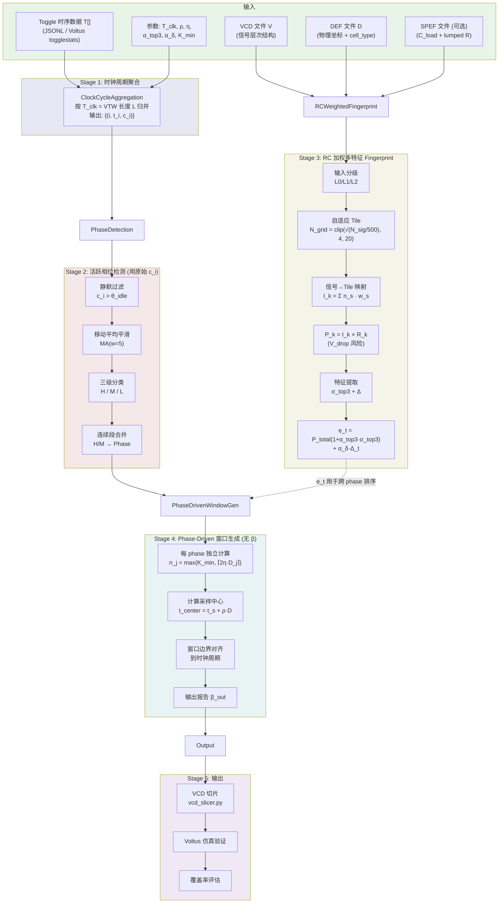
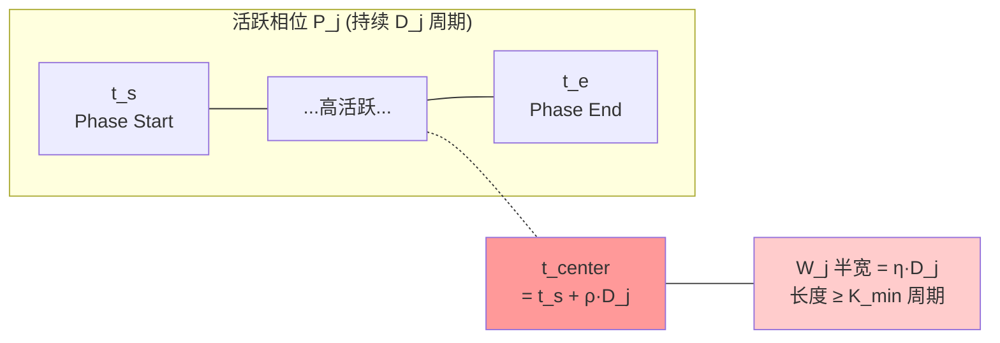

# 基于相位感知与 RC 加权多特征的 Worst-Case 电源噪声窗口选取算法

## 1 问题定义

给定一段完整的动态功耗仿真波形 $\mathcal{W}$（VCD 格式，时长 $T_{\text{sim}}$），从中**自动**生成一组时间窗口 $\{W_1, W_2, \dots\}$，使得所选窗口能覆盖真实 worst-case 电源噪声时刻（包括 IR drop 与 Ldi/dt 噪声两类）。窗口总长度 $\beta_{\text{out}} = \sum_k |W_k| / T_{\text{sim}}$ **作为算法输出报告**，而非输入约束。

算法由 phase 检测结果**自适应**给出窗口数量与长度，仅当下游有硬性资源约束时才在 post-processing 阶段按 $e_t$ 排序保留 Top-N。

## 2 算法概述

本算法从时间、空间、瞬态三个维度建模电源噪声：

| 维度 | 策略 | 核心思想 |
|------|------|----------|
| **时间** | Phase-Aware 退耦耗尽模型 | 在活跃相位的 $\rho \approx 70\%$ 处采样，而非峰值处 |
| **空间** | RC 加权 tile + Top-3 集中度 | $P_k = I_k \cdot R_k$ 显式建模 $V_R = IR$；信号按 $C_{\text{load}}$ 加权 |
| **瞬态** | 相邻 VTW 绝对差 $\Delta_t$ | 显式建模 $V_L = L \cdot di/dt$ |

**物理动机**：
- **时间维度**：IR drop 取决于片上退耦电容（decap）的累积耗尽，worst-case 不在翻转瞬时峰值，而在持续高活跃后电容耗尽的时刻
- **空间维度**：全局 toggle 总量 ≠ 局部 IR drop；相同总 toggle 分散在多个模块远不如集中在单个 tile 危险；且高 PDN 电阻区的中等电流也可能产生大压降
- **瞬态维度**：相邻周期电流剧变（$di/dt$）通过封装/电源网络寄生电感引发额外噪声，与稳态 IR drop 物理上正交

### 2.1 算法流程图



### 2.2 输入分级（Progressive Input Strategy）

| Level | 输入                | 信号权重 $w_s$           | tile 电阻 $R_k$ | 物理保真度  |
| ----- | ------------------- | ------------------------ | --------------- | ----------- |
| L0    | VCD only            | 1.0                      | 1.0             | 最低 |
| L1    | VCD + DEF           | $\text{Area}(\text{cell}_s)$ | 1.0          | 中          |
| **L2** | **VCD + DEF + SPEF** | $C_{\text{load},s}$    | $\hat{R}_{\text{tile}, k}$ | **最高（默认）** |

L2 是默认配置；L0/L1 作为退化兼容路径，使算法在 SPEF 缺失时仍可运行。

## 3 符号定义

### 3.1 时间维度

| 符号 | 含义 |
|------|------|
| $T_{\text{clk}}$ | 时钟周期（ns） |
| $L$ | VTW 长度，默认 $L = T_{\text{clk}}$ |
| $N$ | 总 VTW 数（= 总时钟周期数当 $L = T_{\text{clk}}$） |
| $t_i$ | 第 $i$ 个 VTW 的起始时间 |
| $c_i$ | 第 $i$ 个 VTW 内的 toggle 总数（**不加权**，用于 phase 检测） |
| $\bar{c}_i^{(w)}$ | 以 $i$ 为中心、窗口宽度 $w$ 的移动平均值 |
| $\theta_{\text{idle}}$ | 静默 VTW 阈值（仅时钟翻转的 toggle 数） |
| $\theta_H, \theta_M$ | HIGH / MEDIUM 级别阈值 |
| $\mathcal{P}_j$ | 第 $j$ 个活跃相位（连续 H/M VTW 的集合） |
| $D_j$ | phase $j$ 的持续 VTW 数 |
| $\rho$ | 退耦耗尽采样比（默认 0.7） |
| $\eta$ | 窗口半宽比（默认 0.15） |
| $K_{\min}$ | 每 phase 最小窗口 VTW 数（默认 2） |
| $\beta_{\text{out}}$ | 输出报告的总压缩率 $= \sum_j |W_j| / T_{\text{sim}}$ |

### 3.2 空间维度

| 符号 | 含义 |
|------|------|
| $\text{TrB}(t)$ | Transition Block，$t$ 时刻所有信号翻转的集合 |
| $\text{VTW}_t$ | Vector Time Window，$\text{VTW}_t = \{\text{TrB}(t') : t' \in [t, t+L)\}$ |
| $L_{\text{tile}}$ | Tile 边长（自适应，由 $N_{\text{grid}}$ 推导） |
| $N_{\text{grid}}$ | 每边 tile 数量，自适应 clip 到 $[4, 20]$ |
| $N_{\text{tile}}^{\text{target}}$ | 目标每 tile 平均信号数（默认 500） |
| $w_s$ | 信号 $s$ 的物理权重 $= C_{\text{load},s}$ (L2) / $\text{Area}_{\text{cell}(s)}$ (L1) / $1$ (L0) |
| $\hat{R}_k$ | tile $k$ 的归一化电阻代理（默认 SPEF `*RES` 密度，详见 §4.3.2） |
| $I_{t,k}$ | VTW $t$ 内 tile $k$ 的加权电流代理 $= \sum_{s \in k} n_{s,t} \cdot w_s$ |
| $P_{t,k}$ | VTW $t$ 内 tile $k$ 的局部 V_drop 风险 $= I_{t,k} \cdot \hat{R}_k$ |
| $P_t^{\text{total}}$ | 全局 V_drop 风险 $= \sum_k P_{t,k}$ |
| $\sigma_{\text{top3},t}$ | Top-3 tile 集中度 $= \sum_{k \in \text{top3}} P_{t,k} / P_t^{\text{total}}$ |
| $\Delta_t$ | di/dt 绝对幅度 $= \lvert P_t^{\text{total}} - P_{t-1}^{\text{total}} \rvert$ |
| $e_t$ | VTW $t$ 的最终危险评分（详见 §4.3.3） |
| $\alpha_{\text{top3}}$ | 集中度乘法系数（默认 1.0） |
| $\alpha_\delta$ | di/dt 加法系数（默认 0.5） |

### 3.3 概念形式化（参考 Hu2025）

参考 Hu et al. ACM TODAES 2025 的三层定义：

- **Transition**：$\text{tr}_n(t) = \text{state}$，单信号 $n$ 在时刻 $t$ 的翻转事件
- **Transition Block (TrB)**：$\text{TrB}(t) = \{\text{tr}_n(t),\, \forall n \in N\}$，$t$ 时刻所有信号翻转的集合
- **Vector Time Window (VTW)**：$\text{VTW}(t) = \{\text{TrB}(t'),\, t' \in [t, t+L)\}$，长度 $L$ 的连续 TrB 序列

本算法中"时钟周期" $\equiv$ $\text{VTW}(L = T_{\text{clk}})$ 的特例。这种解耦允许未来扩展到 sub-cycle 分析（$L = T_{\text{clk}}/4$ 等），无需重写算法核心。本文档其余部分在 $L = T_{\text{clk}}$ 假设下使用"VTW"与"周期"两词等价交替。

## 4 算法详细描述

### 4.1 Stage 1：时钟周期聚合

将原始 VCD 采样点（可能每纳秒多次变化）按时钟周期 $T_{\text{clk}}$ 归并，得到每周期的 toggle 总量。

---

**Algorithm 1** ClockCycleAggregation

---

**Input:** 原始时序数据 $\{(t, n)\}$，时钟周期 $T_{\text{clk}}$

**Output:** 周期统计序列 $\{(i, t_i, c_i)\}_{i=0}^{N-1}$

1. **for each** $(t, n) \in$ 原始数据 **do**
2. $\quad i \leftarrow \lfloor t / T_{\text{clk}} \rfloor$
3. $\quad c_i \leftarrow c_i + n$
4. **end for**
5. **return** 按 $i$ 升序排列的 $\{(i,\; i \cdot T_{\text{clk}},\; c_i)\}$

---

### 4.2 Stage 2：活跃相位检测

目标：将仿真时间划分为若干"活跃相位"（Phase），每个 Phase 代表一段持续的高翻转活动区间。

#### 4.2.1 静默过滤

去除仅有时钟翻转的周期：

$$\mathcal{A} = \{i \mid c_i > \theta_{\text{idle}}\}$$

#### 4.2.2 移动平均平滑

对活跃周期序列计算窗口宽度为 $w$（默认 5）的移动平均：

$$\bar{c}_i^{(w)} = \frac{1}{|S_i|} \sum_{j \in S_i} c_j, \quad S_i = [\max(0,\, i - \lfloor w/2 \rfloor),\; \min(|\mathcal{A}|,\, i + \lfloor w/2 \rfloor + 1))$$

#### 4.2.3 三级分类

基于活跃周期 toggle 分布计算自适应阈值：

$$\theta_H = 0.8 \times P_{75}(\{c_i\}_{i \in \mathcal{A}})$$
$$\theta_M = 0.5 \times \text{median}(\{c_i\}_{i \in \mathcal{A}})$$

每个活跃周期根据其移动平均值标注为 $L_i \in \{H, M, L\}$。

**阈值设计意图**：
- **0.8 系数**：$P_{75}$ 已是"前 25%"的门槛，再乘 0.8 **向下放宽 20%**，让更多高活跃周期被纳入 H 类，避免边界遗漏
- **0.5 系数**：median 乘 0.5 大幅降低 M 的入门条件，确保中等活跃周期不被误判为 L 而切断相位连续性
- **使用百分位数而非固定阈值**，使算法能自动适配不同设计规模（toggle 数量级差异可达数个数量级）

---

**Algorithm 2** PhaseDetection

---

**Input:** 周期统计 $\{(i, t_i, c_i)\}$，阈值 $\theta_{\text{idle}}$，MA 窗口 $w$

**Output:** 相位列表 $\{\mathcal{P}_1, \mathcal{P}_2, \dots\}$

1. $\mathcal{A} \leftarrow \{i \mid c_i > \theta_{\text{idle}}\}$ $\quad$ // 提取活跃周期
2. **for each** $i \in \mathcal{A}$ **do**
3. $\quad$ 计算移动平均 $\bar{c}_i^{(w)}$
4. **end for**
5. 计算 $\theta_H \leftarrow 0.8 \times P_{75}$，$\theta_M \leftarrow 0.5 \times \text{median}$
6. **for each** $i \in \mathcal{A}$ **do** $\quad$ // 三级标注
7. $\quad$ **if** $\bar{c}_i^{(w)} \geq \theta_H$ **then** $L_i \leftarrow$ H
8. $\quad$ **else if** $\bar{c}_i^{(w)} \geq \theta_M$ **then** $L_i \leftarrow$ M
9. $\quad$ **else** $L_i \leftarrow$ L
10. **end for**
11. // 合并连续 H/M 段为 Phase，L 段为分界
12. $\text{buf} \leftarrow \emptyset$，$\text{phases} \leftarrow []$
13. **for each** $i \in \mathcal{A}$ **do**
14. $\quad$ **if** $L_i \in \{H, M\}$ **then**
15. $\quad\quad$ $\text{buf} \leftarrow \text{buf} \cup \{i\}$
16. $\quad$ **else** // $L_i = $ L
17. $\quad\quad$ **if** 前方 3 周期内存在 H/M **and** $\text{buf} \neq \emptyset$ **then**
18. $\quad\quad\quad$ $\text{buf} \leftarrow \text{buf} \cup \{i\}$ $\quad$ // 短暂低谷，不切分
19. $\quad\quad$ **else**
20. $\quad\quad\quad$ **if** $\text{buf} \neq \emptyset$ **then** $\text{phases}.\text{append}(\text{buf})$；$\text{buf} \leftarrow \emptyset$
21. $\quad\quad$ **end if**
22. $\quad$ **end if**
23. **end for**
24. **if** $\text{buf} \neq \emptyset$ **then** $\text{phases}.\text{append}(\text{buf})$
25. **return** phases

---

### 4.3 Stage 3：RC 加权多特征 Fingerprint

Stage 3 输出"**电压降风险集中度 + 瞬态噪声**"。引入 per-tile 电阻 $\hat{R}_k$ 后，每个 tile 的危险度是显式建模 $V_R = IR$ 的乘积；并新增独立的 di/dt 加法项以建模 $V_L = L \cdot di/dt$。

#### 4.3.1 自适应 Tile 划分

**为什么不固定使用 20×20**：Hu2025 在百万信号量级的工业 SoC 上验证 20×20=400 tile。中小型设计若硬套此值，平均每 tile 信号数过低，会出现大量空 tile，使集中度特征退化为常数。需按设计规模自适应。

**自适应规则**：设映射到坐标的信号总数为 $N_{\text{sig}}^{\text{mapped}}$，目标每 tile 平均信号数 $N_{\text{tile}}^{\text{target}} = 500$，则：

$$N_{\text{grid}} = \max\left(4,\; \min\left(20,\; \left\lceil \sqrt{N_{\text{sig}}^{\text{mapped}} / N_{\text{tile}}^{\text{target}}}\,\right\rceil\right)\right)$$

$$L_{\text{tile}} = \max(x_{\text{span}}, y_{\text{span}}) / N_{\text{grid}}$$

**clip 边界 $[4, 20]$ 的理由**：
- 下限 4：低于 4×4=16 tile 时 top-3 占比天然 ≥ 18%，特征失去区分度
- 上限 20：与 Hu2025 对齐，超过 20 时单 tile 过细且 SPEF 聚合代价上升

**典型规模查表**：

| 设计规模 ($N_{\text{sig}}^{\text{mapped}}$) | $N_{\text{grid}}$ | tile 数 | 平均/tile |
|---|---|---|---|
| 5K (小测试用例)        | 4         | 16   | ~313 |
| 42K (中型加密核)       | 10        | 100  | ~420 |
| 200K (中型 SoC)       | 20        | 400  | ~500 |
| 1M+ (大型工业 SoC)    | 20 (上限) | 400  | ~2500 |

**信号→Tile 映射**（Grid 模式）：

1. 解析 DEF 文件提取 COMPONENTS / PINS / NETS，获取每个 cell 的 $(x, y)$
2. 通过 NET 的 driver cell 坐标建立信号 → 坐标映射
3. VCD scope 路径 → DEF 层次路径（去 testbench 前缀，`.` → `/`）
4. 信号 $s$ 落到 tile：$\text{col}_s = \lfloor (x_s - x_{\min}) / x_{\text{span}} \times N_{\text{grid}} \rfloor$，行同理

**Scope 模式（VCD-only fallback）**：当无 DEF 时，按 VCD 层次结构在深度 $d$ 处分组，信号 `test.u0.u_des0.clk` 在 $d=2$ 时映射到模块 `test.u0`。此模式不支持 $\hat{R}_k$，强制 L0/L1。

#### 4.3.2 SPEF → tile 电阻 $\hat{R}_k$ 的计算

SPEF 文件给出的是**信号网**的 RC，并非 PDN 电源网的电阻。可以用三种代理策略，按精度递减排序：

| 策略 | 数据来源 | $R_k$ 定义 | 物理直觉 |
|---|---|---|---|
| **S1** | SPEF `*RES` 段（每条 net 的 lumped R） | $R_k = \text{mean}(R_{\text{net}})_{s \in k}$ | 信号布线密集 → 同区电源走线稀疏 → PDN R 高 |
| **S2** | SPEF `*CAP` 总电容密度 | $R_k \propto 1 / \text{cap\_density}_k$ | 间接但实现简单 |
| **S3** | DEF METAL 层 wirelength 密度 | $R_k \propto \text{wire\_density}_k$ | 不需要 SPEF |

**默认采用 S1**。归一化到无量纲：

$$\hat{R}_k = R_k / \text{median}(R_k)$$

最终 $\hat{R}_k$ clip 到 $[0.5, 2.5]$ 防止极端值主导。

> **诚实声明**：信号网 R 不是 PDN R，本质是统计相关而非物理等价。论文中可表述为：*"以信号网 RC 密度作为 PDN 电阻的代理，因为商业 P&R 工具的布线拥塞与电源网走线密度呈强相关"*。要做到完全精确需要 Voltus 的 PDN extraction，与"加速 vector profiling"的初衷相悖，故采用代理方案作为精度/复杂度折衷。**首次应用新设计前应做一次 $\hat{R}_k$ 与真实 PDN 压降的相关性校准。**

#### 4.3.3 危险评分公式

评分公式（精简版，仅 2 个超参数）：

$$\boxed{e_t = P_t^{\text{total}} \cdot \left(1 + \alpha_{\text{top3}} \cdot \sigma_{\text{top3},t}\right) \;+\; \alpha_\delta \cdot \Delta_t}$$

其中：

- $I_{t,k} = \sum_{s \in \text{tile } k} n_{s,t} \cdot w_s$（开关电流代理；开关电流 $\propto C \cdot V_{dd} \cdot f \cdot \alpha_{sw}$，省略常数项）
- $P_{t,k} = I_{t,k} \cdot \hat{R}_k$（局部 V_drop 风险，物理意义为 $V_R = IR$）
- $P_t^{\text{total}} = \sum_k P_{t,k}$（全局风险幅度）
- $\sigma_{\text{top3},t} = \sum_{k \in \text{top3}} P_{t,k} / P_t^{\text{total}} \in (0, 1]$（Top-3 集中度）
- $\Delta_t = |P_t^{\text{total}} - P_{t-1}^{\text{total}}|$（di/dt 绝对幅度，$\Delta_0 \equiv 0$）

**两项的物理对应**：

$$e_t = \underbrace{P_t^{\text{total}}(1 + \alpha_{\text{top3}}\sigma_{\text{top3},t})}_{\text{IR drop 风险（稳态）}\,V_R = IR} \;+\; \underbrace{\alpha_\delta \cdot \Delta_t}_{\text{Ldi/dt 风险（瞬态）}\,V_L}$$

这种显式分解将稳态电阻压降与瞬态电感效应清晰分离。

#### 4.3.4 设计选择说明

**为什么用 $\sigma_{\text{top3}}$ 而非单 $\sigma = \max/\text{total}$**：
- $\sigma_{\text{top3}}$ 的特例 $k=1$ 即 $\sigma$，是其超集
- 单 max 对长尾分布敏感，Top-3 是抗噪平均
- 在加密核类设计上两者相关系数 > 0.9，保留两者会引入冗余超参

**为什么 $\Delta$ 用绝对量而非相对变化率**：
物理上 $V_L \propto \Delta I / \Delta t$，**正比于绝对变化量**。若用相对量 $|P_t - P_{t-1}|/\max(P_t, P_{t-1})$，会把"100→50"和"10000→5000"等同处理，物理上前者可忽略而后者严重。

**为什么 $\Delta$ 是加法而非乘法项**：
$\sigma_{\text{top3}}$ 是无量纲集中度（0~1），适合写成 $(1+\alpha\sigma)$。但 $\Delta_t$ 与 $P_t^{\text{total}}$ 同量纲，塞进乘法括号会破坏量纲一致性。改为加法既保持量纲齐次，又在物理上正确分离 $V_R$ 与 $V_L$ 两类噪声。

**$\alpha_{\text{top3}}, \alpha_\delta$ 默认值的量纲推导**：
考虑 $\Delta_t \approx P_t^{\text{total}}$ 的最坏 di/dt 情形，$e_t \approx P^{\text{total}}(1 + \alpha_{\text{top3}}\sigma_{\text{top3}} + \alpha_\delta)$。为使总放大量保持在 $1 + \alpha\sigma \le 2$ 量级，令 $\alpha_{\text{top3}} + \alpha_\delta \approx 1.5$，取：

$$\alpha_{\text{top3}} = 1.0,\quad \alpha_\delta = 0.5$$

**为什么 $e_t$ 不用于 phase 检测**：
Stage 2 的 $\theta_{\text{idle}}$、$\theta_H$、$\theta_M$ 是针对原始 toggle 量 $c_i$ 标定的，若用加权后的 $e_t$ 切 phase，阈值会失效。$e_t$ 仅用于跨 phase 的窗口优先级排序与 post-processing 阶段的 Top-N 截断。

#### 4.3.5 算法

---

**Algorithm 3** RCWeightedFingerprint

---

**Input:**
- 信号级 toggle 数据 $\{(t, \{s: b_s\})\}$
- tile 映射 $\phi: s \mapsto k$（由 §4.3.1 自适应规则确定 $N_{\text{grid}}$）
- 信号权重 $\{w_s\}$（L2: $C_{\text{load},s}$ / L1: $\text{Area}_{\text{cell}(s)}$ / L0: 1）
- tile 电阻 $\{\hat{R}_k\}$（L2: SPEF S1 代理 / L0/L1: 1）
- 超参 $\alpha_{\text{top3}}, \alpha_\delta$

**Output:** 危险评分序列 $\{(t, e_t, \sigma_{\text{top3},t}, \Delta_t)\}$

1. $P^{\text{total}}_{\text{prev}} \leftarrow 0$
2. **for each** VTW $t$ **do**
3. $\quad$ $I[k] \leftarrow 0$ for all tile $k$ $\quad$ // 加权电流代理
4. $\quad$ **for each** signal $s$ with toggle bits $b_{s,t}$ **do**
5. $\quad\quad$ $n_s \leftarrow \text{popcount}(b_{s,t})$
6. $\quad\quad$ $I[\phi(s)] \mathrel{+}= n_s \cdot w_s$
7. $\quad$ **end for**
8. $\quad$ $P[k] \leftarrow I[k] \cdot \hat{R}_k$ for all $k$ $\quad$ // V_drop 风险
9. $\quad$ $\text{nonempty} \leftarrow \{k : P[k] > 0\}$
10. $\quad$ $P^{\text{total}} \leftarrow \sum_{k \in \text{nonempty}} P[k]$
11. $\quad$ **if** $|\text{nonempty}| \geq 3$ **then**
12. $\quad\quad$ $\text{sorted} \leftarrow$ sort $P[\text{nonempty}]$ descending
13. $\quad\quad$ $\sigma_{\text{top3},t} \leftarrow (\text{sorted}[0] + \text{sorted}[1] + \text{sorted}[2]) / P^{\text{total}}$
14. $\quad$ **else** $\sigma_{\text{top3},t} \leftarrow 1.0$ $\quad$ // 退化保护
15. $\quad$ $\Delta_t \leftarrow |P^{\text{total}} - P^{\text{total}}_{\text{prev}}|$
16. $\quad$ $e_t \leftarrow P^{\text{total}} \cdot (1 + \alpha_{\text{top3}} \cdot \sigma_{\text{top3},t}) + \alpha_\delta \cdot \Delta_t$
17. $\quad$ $P^{\text{total}}_{\text{prev}} \leftarrow P^{\text{total}}$
18. **end for**
19. **return** $\{(t, e_t, \sigma_{\text{top3},t}, \Delta_t)\}$

---

### 4.4 Stage 4：Phase-Driven 窗口生成（无预算）

核心思想：IR Drop 的 worst-case 不在翻转峰值时刻，而在退耦电容经过持续放电后接近耗尽的时刻。对于一个从 $t_s$ 开始、持续 $D$ 个时钟周期的活跃相位，电容耗尽点大约出现在：

$$t_{\text{depletion}} = t_s + \rho \cdot D \cdot T_{\text{clk}}$$

其中 $\rho$ 为退耦耗尽比，经验值 $\rho = 0.7$（即相位持续时间的 70% 处）。

每个 phase **独立**产生一个窗口，长度由 phase 自身的持续时间 $D_j$ 决定，**总压缩率作为算法输出报告而非输入约束**。



#### 4.4.1 窗口生成规则

每个 phase $\mathcal{P}_j$ 独立生成窗口 $W_j$：

$$W_j.\text{start} = t_s^{(j)} + (\rho - \eta) \cdot D_j \cdot T_{\text{clk}}$$

$$W_j.\text{end}\;\;\, = t_s^{(j)} + (\rho + \eta) \cdot D_j \cdot T_{\text{clk}}$$

对齐到时钟周期边界，并保证至少 $K_{\min}$ 个周期：

$$n_j = \max\left(K_{\min},\; \lceil 2\eta \cdot D_j \rceil\right)$$

**关键性质**：

- **窗口长度自适应 phase 规模**：长 phase 给宽窗口（捕获更长退耦累积区间），短 phase 给窄窗口（避免浪费）
- **总压缩率自然产生**：$\beta_{\text{out}} = \sum_j n_j \cdot T_{\text{clk}} / T_{\text{sim}}$ 作为算法**输出报告**而非输入约束
- **算法只回答"哪些时刻最危险"**，不被迫在某个预算内做妥协
- **可选硬上限（post-processing）**：若运行环境对窗口数量有硬约束，可在输出端按 $e_t$（来自 Stage 3）排序保留 Top-N，但这是 post-processing，不污染算法本体

---

**Algorithm 4** PhaseDrivenWindowGeneration

---

**Input:** 相位列表 $\{\mathcal{P}_j\}$，仿真总时长 $T_{\text{sim}}$，退耦耗尽比 $\rho$，半宽比 $\eta$，最小窗口数 $K_{\min}$，时钟周期 $T_{\text{clk}}$

**Output:** 窗口列表 $\{W_1, W_2, \dots\}$，输出压缩率 $\beta_{\text{out}}$

1. 过滤 $|\mathcal{P}_j| < n_{\min}$ 的微小相位
2. **for each** 相位 $\mathcal{P}_j$ with $[t_s^{(j)}, t_e^{(j)}]$ **do**
3. $\quad$ $D_j \leftarrow (t_e^{(j)} - t_s^{(j)}) / T_{\text{clk}}$
4. $\quad$ $n_j \leftarrow \max\left(K_{\min},\; \lceil 2\eta \cdot D_j \rceil\right)$ $\quad$ // 自适应窗口周期数
5. $\quad$ $t_{\text{center}} \leftarrow t_s^{(j)} + \rho \cdot D_j \cdot T_{\text{clk}}$
6. $\quad$ $W_j.\text{start} \leftarrow \text{align\_to\_clock}(t_{\text{center}} - n_j \cdot T_{\text{clk}} / 2)$
7. $\quad$ $W_j.\text{end} \leftarrow W_j.\text{start} + n_j \cdot T_{\text{clk}}$
8. $\quad$ Clip $W_j$ to $[t_s^{(j)} - T_{\text{clk}},\; t_e^{(j)} + T_{\text{clk}}]$
9. $\quad$ Clip $W_j$ to $[0,\; T_{\text{sim}}]$
10. **end for**
11. $\beta_{\text{out}} \leftarrow \sum_j |W_j| / T_{\text{sim}}$ $\quad$ // 输出报告值
12. **return** $\{W_j\}$ 按 $e_t$ 总和降序排列, $\beta_{\text{out}}$

---

#### 4.4.2 退耦耗尽模型的物理直觉

IR Drop 最坏时刻 $\neq$ toggle 最高时刻。片上退耦电容（decap）类似一个"电池"，在持续高活跃放电后约 70% 处耗尽，**此时**才是 IR Drop 最严重的时刻：

```
片上退耦电容剩余电量
  ▲
  █████
  █    ████
  █        ████
  █            ███
  █               ██  ← ρ=0.7 处，电容接近耗尽，IR Drop 最大！
  █                 █
  ├───────────────────→ 时间
  t_s                t_e
      活跃相位持续期间
```

类比：如同手电筒——朴素方法选"按开关次数最多"的时刻，但此时电池满、灯最亮；本算法选"电池快耗尽"的时刻，此时电压下降最严重。

### 4.5 完整算法

---

**Algorithm 5** FindWorstCaseWindow

---

**Input:**
- Toggle 时序文件 $\mathcal{T}$（JSONL 格式，每行含时间戳和各信号 toggle 位串）
- VCD 文件 $\mathcal{V}$（提供信号层次结构）
- DEF 文件 $\mathcal{D}$（可选，L1+ 启用）
- SPEF 文件 $\mathcal{S}$（可选，L2 启用）
- 参数：$T_{\text{clk}}$, $\rho$, $\eta$, $K_{\min}$, $\alpha_{\text{top3}}$, $\alpha_\delta$, $N_{\text{tile}}^{\text{target}}$

**Output:** 排序后的 worst-case 窗口列表 $\{W_1, W_2, \dots\}$，输出压缩率 $\beta_{\text{out}}$

1. // ─── 输入分级与权重/电阻准备 ───
2. **if** $\mathcal{S}$ provided **then** $\quad$ // L2
3. $\quad$ $\{(C_{\text{load},s}, R_{\text{net},s})\} \leftarrow$ ParseSPEF($\mathcal{S}$)
4. $\quad$ $w_s \leftarrow C_{\text{load},s}$
5. **else if** $\mathcal{D}$ provided **then** $\quad$ // L1
6. $\quad$ $w_s \leftarrow \text{Area}(\text{cell\_type}(s))$ via cell_area LUT
7. **else** $\quad$ // L0
8. $\quad$ $w_s \leftarrow 1$
9. **end if**
10.
11. // ─── 自适应 tile 映射 ───
12. **if** $\mathcal{D}$ provided **then**
13. $\quad$ $N_{\text{grid}} \leftarrow \text{clip}(\lceil\sqrt{N_{\text{sig}}^{\text{mapped}}/N_{\text{tile}}^{\text{target}}}\rceil,\, 4,\, 20)$
14. $\quad$ $\phi \leftarrow$ BuildGridMap($\mathcal{V}$, $\mathcal{D}$, $N_{\text{grid}}$)
15. $\quad$ **if** $\mathcal{S}$ provided **then** $\hat{R}_k \leftarrow$ AggregateTileResistance($\mathcal{S}$, $\phi$)
16. $\quad$ **else** $\hat{R}_k \leftarrow 1$
17. **else**
18. $\quad$ $\phi \leftarrow$ BuildScopeMap($\mathcal{V}$, $d$); $\hat{R}_k \leftarrow 1$ $\quad$ // L0 fallback
19. **end if**
20.
21. // ─── 时间维度分析（用原始 c_i，不受加权影响） ───
22. $\{(i, t_i, c_i)\} \leftarrow$ ClockCycleAggregation($\mathcal{T}$, $T_{\text{clk}}$)
23. $\{\mathcal{P}_j\} \leftarrow$ PhaseDetection($\{(i, t_i, c_i)\}$)
24.
25. // ─── 空间维度：RC 加权多特征 fingerprint ───
26. $\{(t, e_t, \sigma_{\text{top3},t}, \Delta_t)\} \leftarrow$ RCWeightedFingerprint($\mathcal{T}$, $\phi$, $w_s$, $\hat{R}_k$, $\alpha_{\text{top3}}$, $\alpha_\delta$)
27.
28. // ─── Phase-Driven 窗口生成（无 β 输入） ───
29. $(\{W_k\}, \beta_{\text{out}}) \leftarrow$ PhaseDrivenWindowGeneration($\{\mathcal{P}_j\}$, $T_{\text{sim}}$, $\rho$, $\eta$, $K_{\min}$, $T_{\text{clk}}$)
30.
31. // ─── 用 e_t 回填窗口排序键 ───
32. **for each** $W_k$ **do**
33. $\quad$ $W_k.\text{score} \leftarrow \sum_{t_i \in W_k} e_{t_i}$
34. **end for**
35.
36. **return** $\{W_k\}$ ranked by score descending, $\beta_{\text{out}}$

---

## 5 参数选择依据

| 参数 | 默认值 | 选择依据 |
|------|--------|----------|
| $T_{\text{clk}}$ | 50 ns | 目标设计的时钟周期 |
| $L$ (VTW 长度) | $T_{\text{clk}}$ | 默认与时钟周期对齐；可选 $T_{\text{clk}}/4$ 做 sub-cycle 分析 |
| $\theta_{\text{idle}}$ | 200 | 经验值：纯时钟网络每周期约 100\~200 次翻转 |
| MA 窗口 $w$ | 5 | 平滑 2\~3 个周期的短暂波动 |
| $\rho$ | 0.7 | 退耦电容耗尽点经验值，约在活跃相位 70% 位置 |
| $\eta$ (窗口半宽比) | 0.15 | 窗口 = $[\rho - \eta,\,\rho + \eta] \cdot D_j$；半宽 15% 平衡覆盖与压缩率 |
| $K_{\min}$ | 2 | 每 phase 最小窗口周期数（防止极短 phase 退化为 0 周期） |
| $\alpha_{\text{top3}}$ | 1.0 | Top-3 集中度乘法系数 |
| $\alpha_\delta$ | 0.5 | di/dt 加法系数；量纲分析见 §4.3.4 |
| $N_{\text{tile}}^{\text{target}}$ | 500 | 自适应 tile 目标信号数/tile |
| $N_{\text{grid}}$ | **自适应** | clip 到 $[4, 20]$，由 $\sqrt{N_{\text{sig}}/N_{\text{tile}}^{\text{target}}}$ 推导 |
| 层次深度 $d$ | 2 | Scope 模式 fallback 的 RTL 子模块级别（如 `u_soc.u_des0`） |
| $n_{\min}$ | 3 | 过滤过短的活跃段，避免噪声相位 |

### 5.1 阈值自适应性分析

$\theta_H$ 和 $\theta_M$ 采用百分位数（P75、median）而非固定绝对值，使算法能够**自动适配不同设计规模**。但固定的系数（0.8、0.5）在不同 toggle 分布形态下表现不一。

#### 5.1.1 跨设计规模的自动缩放

| | 小设计 (500 信号) | 中设计 (42K 信号) | 大设计 (500K 信号) |
|---|---|---|---|
| 活跃周期 toggle 范围 | 50 \~ 400 | 300 \~ 2500 | 5000 \~ 80000 |
| median | 200 | 1600 | 40000 |
| P75 | 320 | 1900 | 65000 |
| $\theta_H = 0.8 \times P_{75}$ | **256** | **1520** | **52000** |
| $\theta_M = 0.5 \times \text{median}$ | **100** | **800** | **20000** |

阈值自动跟随数据规模变化，无需手动调参。

#### 5.1.2 不同分布形态下的局限性

固定系数 0.8/0.5 在以下三种典型 toggle 分布形态下表现各异：

**场景 A：双峰分布**（典型设计：有明确工作/空闲两态的 SoC）

```
频次 ▲
     █                          █ █
     █ █                      █ █ █
     █ █ █                  █ █ █ █
     ├─────────────────────────────→ toggle
     低(空闲)                高(活跃)
```

P75 落在高峰群中，median 可能落在两峰之间空隙。$\theta_H$ 能精准切分高峰；但 $\theta_M = 0.5 \times \text{median}$ 可能偏低，导致几乎所有非空闲周期都标为 M，整段仿真合为一个巨大 Phase。

**场景 B：均匀分布**（典型设计：持续均匀工作的流水线、加密核）

```
频次 ▲
     █ █ █ █ █ █ █ █ █ █ █ █ █
     ├─────────────────────────→ toggle
```

$\theta_H$ 和 $\theta_M$ 表现合理，Phase 划分正常。

**场景 C：长尾分布**（典型设计：突发性负载如 DMA burst、中断处理）

```
频次 ▲
     █ █ █
     █ █ █ █
     █ █ █ █ █ █
     █ █ █ █ █ █ █ █ █ █                    █
     ├───────────────────────────────────────→ toggle
     大部分中低                          极少数高峰
```

**用长尾数据演示问题**：假设 20 个活跃周期 toggle 值排序后为：

```
[100, 120, 150, 180, 200, 220, 250, 280, 300, 350,
 380, 400, 420, 450, 500, 550, 600, 800, 2000, 5000]
```

计算：
- $\text{median} = (350 + 380) / 2 = 365$
- $P_{75}$：位置 $= 0.75 \times 19 = 14.25$，插值得 $500 + 0.25 \times (550 - 500) = 512.5$
- $\theta_H = 0.8 \times 512.5 = 410$
- $\theta_M = 0.5 \times 365 = 182.5$

分类结果：仅 3 个 L（toggle < 182.5），4 个 H（toggle ≥ 410），其余 13 个全是 M。绝大多数周期被归入同一个 Phase，真正危险的周期（2000, 5000）淹没在一大片 M/H 中，**丧失了区分能力**。

#### 5.1.3 可能的改进方向

| 改进思路 | 方法 | 适合场景 |
|---------|------|---------|
| **IQR 分位数直接做阈值** | $\theta_H = Q_3$，$\theta_M = Q_1$ | 所有分布，但对偏态敏感 |
| **MAD 鲁棒阈值** | $\theta_H = \text{median} + k \times \text{MAD}$（中位数绝对偏差） | 长尾分布，抗异常值 |
| **对数域分位数** | 先取 $\log(c_i)$ 再算 P75/median，映射回原始域 | 跨数量级的长尾分布 |
| **Otsu 自动阈值** | 最小化类内方差，自动找最佳二/三分点 | 双峰分布效果最好 |
| **偏度自适应系数** | 根据 skewness 动态调整系数：偏度大时提高系数 | 通用 |

**对数域方案示例**：对上述长尾数据取 $\log$ 后，$P_{75}^{\log} \approx 6.3$（对应 $e^{6.3} \approx 545$）。使用 $\theta_H = e^{P_{75}^{\log}} = 545$（不乘 0.8），则仅 toggle > 545 的被标 H（即 {600, 800, 2000, 5000}），成功将真正的高峰与大量中低值区分开。

#### 5.1.4 自适应性总结

| 层面 | 自适应能力 | 局限 |
|------|----------|------|
| **数量级适应**（不同信号规模） | 百分位数自动缩放，**完全自适应** | 无 |
| **分布形态适应**（双峰/均匀/长尾） | 固定系数 0.8/0.5 **不够灵活** | 长尾分布下 H/M 区分度不足；双峰分布下 M 阈值可能过低 |

当前 0.8 和 0.5 系数在加密核类（toggle 分布相对均匀）设计上验证有效。若需推广到分布形态差异大的设计，建议引入分布感知的自适应策略。

## 6 时间复杂度

设原始采样点数为 $S$，信号数为 $N_{\text{sig}}$，VTW 数为 $C = T_{\text{sim}} / L$，tile 数为 $K = N_{\text{grid}}^2 \le 400$：

| 阶段 | 复杂度 |
|------|--------|
| SPEF 解析（L2 一次性） | $O(N_{\text{SPEF}})$，单遍扫描 |
| 时钟周期聚合 | $O(S)$ |
| Phase Detection（MA + 分类 + 合并） | $O(C \cdot w)$ |
| RC 加权 fingerprint（$P_k$, $\sigma_{\text{top3}}$, $\Delta$） | $O(S \cdot N_{\text{sig}} + C \cdot K \log K)$ |
| DEF 解析 + tile 映射 | $O(N_{\text{DEF}})$ |
| Phase-Driven 窗口生成 | $O(P)$，$P$ 为相位数（通常 $\ll C$） |
| **总计** | $O(S \cdot N_{\text{sig}} + N_{\text{DEF}} + N_{\text{SPEF}})$ |

算法为单遍扫描，无迭代优化步骤，适用于大规模工业设计。$K \log K$ 项（来自 Top-3 排序）相对 $S \cdot N_{\text{sig}}$ 可忽略，因 $K \le 400$。

## 7 算法实现

| 文件 | 功能 |
|------|------|
| `select_worst_window.py` | 核心库：ClockCycleAggregation, PhaseDetection, PhaseDrivenWindowGeneration |
| `find_worst_window.py` | 完整入口：主流程，输出 $\beta_{\text{out}}$ |
| `vcd_def_mapper.py` | DEF 解析 + VCD 信号→物理坐标映射，CSV 含 `cell_area`、`c_load`、`r_net` 三列 |
| `vcd_slicer.py` | VCD 时间窗口切片（保持 hold-last-value 正确性） |
| `coverage_tier1.py` | 自动覆盖率评估：解析 Voltus 报告并计算 $C_1$, $C_{\text{layer}}$ |
| `spef_parser.py` | 流式 SPEF parser：NAME_MAP / `*D_NET` ($C_{\text{load}}$) / `*RES` (lumped R) |
| `cell_area_lut.py` | ASAP7 .lib → cell_type → area_µm² 字典（L1 fallback） |
| `multi_feature_spatial.py` | Algorithm 3 实现：$P_k = I_k \times R_k$ + $\sigma_{\text{top3}}$ + $\Delta$ 单遍计算 |
| `tile_resistance.py` | SPEF → tile 电阻 $\hat{R}_k$ 聚合（S1/S2/S3 三种代理 + clip 归一化） |

## 8 案例演示

以下用一段简化仿真数据贯穿演示全算法流程。案例参数：$T_{\text{clk}} = 50$ ns，$T_{\text{sim}} = 1000$ ns（共 20 个时钟周期），$\rho = 0.7$，$\eta = 0.15$，$K_{\min} = 2$。

### 8.1 Stage 1：时钟周期聚合

假设原始 VCD 中存在大量纳秒级采样点，经 Algorithm 1 按 $T_{\text{clk}} = 50$ ns 归并后，得到 20 个周期的 toggle 总量：

| 周期 $i$ | 起始时间 $t_i$ (ns) | toggle 数 $c_i$ |
|----------|---------------------|-----------------|
| 0 | 0 | 50 |
| 1 | 50 | 80 |
| 2 | 100 | 120 |
| 3 | 150 | **1500** |
| 4 | 200 | **1800** |
| 5 | 250 | **2200** |
| 6 | 300 | **1600** |
| 7 | 350 | **1400** |
| 8 | 400 | **1100** |
| 9 | 450 | 300 |
| 10 | 500 | 100 |
| 11 | 550 | 60 |
| 12 | 600 | **1300** |
| 13 | 650 | **1900** |
| 14 | 700 | **2500** |
| 15 | 750 | **2100** |
| 16 | 800 | **1700** |
| 17 | 850 | 400 |
| 18 | 900 | 90 |
| 19 | 950 | 70 |

> **观察**：周期 14 的 toggle=2500 为全局最大值。朴素滑动窗口法会直接选中它，但如后续阶段所示，IR Drop worst-case 未必在此处。

### 8.2 Stage 2：活跃相位检测全流程

**Step 1 — 静默过滤**（$\theta_{\text{idle}} = 200$）

去掉 toggle $\leq 200$ 的周期（仅时钟翻转），得到活跃集合：

$$\mathcal{A} = \{3, 4, 5, 6, 7, 8, 9, 12, 13, 14, 15, 16, 17\}$$

周期 0,1,2,10,11,18,19 被判定为"静默"，共 13 个活跃周期。

**Step 2 — 移动平均**（窗口 $w=5$）

对活跃周期序列（按活跃序号排列）计算 5 点滑动平均。注意边界处窗口缩小：

| 活跃序号 | 周期 $i$ | $c_i$ | MA 窗口内的值 | 移动平均 $\bar{c}$ |
|---------|----------|-------|--------------|-------------------|
| 0 | 3 | 1500 | [1500, 1800, 2200] | 1833 |
| 1 | 4 | 1800 | [1500, 1800, 2200, 1600] | 1775 |
| 2 | 5 | 2200 | [1500, 1800, 2200, 1600, 1400] | 1700 |
| 3 | 6 | 1600 | [1800, 2200, 1600, 1400, 1100] | 1620 |
| 4 | 7 | 1400 | [2200, 1600, 1400, 1100, 300] | 1320 |
| 5 | 8 | 1100 | [1600, 1400, 1100, 300, 1300] | 1140 |
| 6 | 9 | 300 | [1400, 1100, 300, 1300, 1900] | 1200 |
| 7 | 12 | 1300 | [1100, 300, 1300, 1900, 2500] | 1420 |
| 8 | 13 | 1900 | [300, 1300, 1900, 2500, 2100] | 1620 |
| 9 | 14 | 2500 | [1300, 1900, 2500, 2100, 1700] | 1900 |
| 10 | 15 | 2100 | [1900, 2500, 2100, 1700, 400] | 1720 |
| 11 | 16 | 1700 | [2500, 2100, 1700, 400] | 1675 |
| 12 | 17 | 400 | [2100, 1700, 400] | 1400 |

**Step 3 — 自适应阈值计算（P75 与 Median 详解）**

阈值基于活跃周期 **原始 toggle 值** $\{c_i\}_{i \in \mathcal{A}}$ 的统计分位数计算。

先将 13 个活跃周期的 $c_i$ 升序排列：

| 排名 | 1 | 2 | 3 | 4 | 5 | 6 | **7** | 8 | 9 | **10** | 11 | 12 | 13 |
|------|---|---|---|---|---|---|-------|---|---|--------|----|----|-----|
| $c_i$ | 300 | 400 | 1100 | 1300 | 1400 | 1500 | **1600** | 1700 | 1800 | **1900** | 2100 | 2200 | 2500 |

**Median（中位数，P50）的计算**：

$n = 13$（奇数），中位数为排在正中间的值：

$$\text{位置} = \frac{n+1}{2} = \frac{14}{2} = 第 7 个$$

$$\text{median} = 1600$$

**P75（第 75 百分位数）的计算**：

P75 含义：75% 的数据 $\leq$ 此值。使用线性插值法（与 Python `numpy.percentile` 默认一致）：

$$L = \frac{75}{100} \times (n - 1) = 0.75 \times 12 = 9.0$$

$L = 9.0$ 为整数，直接取 0-indexed 第 9 个值（即排名第 10）：

$$P_{75} = 1900$$

> **插值说明**：若 $L$ 不为整数，例如 $L = 9.3$，则在第 10 和第 11 个值之间线性插值：
> $P_{75} = \text{val}[9] + 0.3 \times (\text{val}[10] - \text{val}[9])$。

**代入阈值公式**：

$$\theta_H = 0.8 \times P_{75} = 0.8 \times 1900 = 1520$$
$$\theta_M = 0.5 \times \text{median} = 0.5 \times 1600 = 800$$

**Step 4 — 三级分类**

用移动平均 $\bar{c}$ 对比阈值进行分类：

| 周期 $i$ | $\bar{c}$ | 分类 |
|----------|-----------|------|
| 3 | 1833 | **H** ($\geq 1520$) |
| 4 | 1775 | **H** |
| 5 | 1700 | **H** |
| 6 | 1620 | **H** |
| 7 | 1320 | M ($\geq 800, < 1520$) |
| 8 | 1140 | M |
| 9 | 1200 | M |
| 12 | 1420 | M |
| 13 | 1620 | **H** |
| 14 | 1900 | **H** |
| 15 | 1720 | **H** |
| 16 | 1675 | **H** |
| 17 | 1400 | M |

**Step 5 — 合并连续段为 Phase**

- 周期 3\~9：全部为 H 或 M，合并为连续段
- 周期 10, 11：静默（不在 $\mathcal{A}$ 中），形成断裂
- 周期 12\~17：全部为 M 或 H，合并为连续段

最终结果：

| 相位 | 包含周期 | 起始 $t_s$ (ns) | 结束 $t_e$ (ns) | 持续周期数 $D$ |
|------|---------|-----------------|-----------------|---------------|
| **Phase 1** | $i = 3 \sim 9$ | 150 | 500 | 7 |
| **Phase 2** | $i = 12 \sim 17$ | 600 | 900 | 6 |

### 8.3 Stage 3：$V = IR$ 建模能捕获被忽略的热点

考虑两个 tile 的对比场景：

| Tile | $I_k$ | $\hat{R}_k$ | $P_k = I_k \hat{R}_k$ | 仅看电流 ($g = I$) | 加权后判定 ($P$) |
|---|---|---|---|---|---|
| A | 100 (高电流) | 1.0 (PDN strap 密集) | 100 | ⚠️ 危险 | 安全 |
| B | 40 (中等电流) | 4.0 (远离 strap) | **160** | 安全 | ⚠️ 危险 |

仅看 $g = I$ 会把 A 标为热点；通过 $P = IR$ 正确识别出 B 才是真正的压降危险区（中等电流叠加高电阻）。这正是纯电流模型的盲区——电源 strap 稀疏的角落区域、长走线驱动的远端 cell——其 toggle 数中等，但实际 IR drop 可能超过中心高 toggle 区。

**Top-3 vs Max 抗噪示例**：

设 5 个非空 tile 风险序列 $P = [120, 110, 100, 95, 90]$（均匀长尾），$P^{\text{total}} = 515$：

- $\sigma_{\max} = 120/515 = 0.233$
- $\sigma_{\text{top3}} = (120+110+100)/515 = 0.641$

而对极端集中场景 $P = [400, 30, 30, 30, 25]$，$P^{\text{total}} = 515$：

- $\sigma_{\max} = 400/515 = 0.777$
- $\sigma_{\text{top3}} = (400+30+30)/515 = 0.893$

两种场景下 Top-3 都给出更平稳的"集中度"指标，避免单点 max 的剧烈跳变。

### 8.4 Stage 4：Phase-Driven 窗口生成

延续 §8.2 检测到的两个相位：

- Phase 1：周期 3\~9，$t_s = 150$ ns，$t_e = 500$ ns，$D_1 = 7$
- Phase 2：周期 12\~17，$t_s = 600$ ns，$t_e = 900$ ns，$D_2 = 6$

**Step 1 — 自适应窗口长度**

|                      | Phase 1                            | Phase 2                          |
| -------------------- | ---------------------------------- | -------------------------------- |
| $D_j$                | 7 cycles                           | 6 cycles                         |
| $\lceil 2\eta D_j \rceil$ | $\lceil 2.1 \rceil = 3$       | $\lceil 1.8 \rceil = 2$          |
| $n_j$                | $\max(2, 3) = 3$                   | $\max(2, 2) = 2$                 |

**Step 2 — 计算窗口中心（退耦耗尽点）**

$$t_{\text{center}}^{(1)} = 150 + 0.7 \times 7 \times 50 = 395 \text{ ns}$$

$$t_{\text{center}}^{(2)} = 600 + 0.7 \times 6 \times 50 = 810 \text{ ns}$$

**Step 3 — 窗口边界（对齐到时钟周期）**

| 窗口 | 长度 | 对齐前 | 对齐后 | 覆盖周期 |
|---|---|---|---|---|
| $W_1$ | 150 ns (3 cycles) | $[395-75,\, 395+75] = [320, 470]$ | $[300, 450]$ | $i=6,7,8$ |
| $W_2$ | 100 ns (2 cycles) | $[810-50,\, 810+50] = [760, 860]$ | $[750, 850]$ | $i=15,16$ |

**Step 4 — 输出报告**

$$\beta_{\text{out}} = \frac{|W_1| + |W_2|}{T_{\text{sim}}} = \frac{150 + 100}{1000} = \mathbf{25\%}$$

| 窗口 | 范围 (ns) | 对应周期 | 占总时长 |
|------|----------|---------|---------|
| $W_1$ | 300 \~ 450 | $i = 6, 7, 8$ | 15% |
| $W_2$ | 750 \~ 850 | $i = 15, 16$ | 10% |
| **合计 $\beta_{\text{out}}$** | — | — | **25%** |

### 8.5 策略对比：为什么不选 toggle 最大的周期？

| 策略 | 选中时间点（本案例） | 物理意义 |
|------|-----------|---------|
| **朴素 max-toggle** | 周期 14（700ns, toggle=2500） | 翻转瞬时峰值，但 decap 刚开始放电，电容充足，IR Drop 不严重 |
| **本算法 $W_1$** | 周期 6\~8（300\~450ns） | Phase 1 经过 ~3 个高活跃周期后，decap 接近耗尽，IR Drop 最严重 |
| **本算法 $W_2$** | 周期 15\~16（750\~850ns） | Phase 2 经过 ~3 个高活跃周期后，decap 接近耗尽 |

本算法放弃了全局 toggle 最大的周期 14，转而选择每个活跃相位的 70% 退耦耗尽点。
