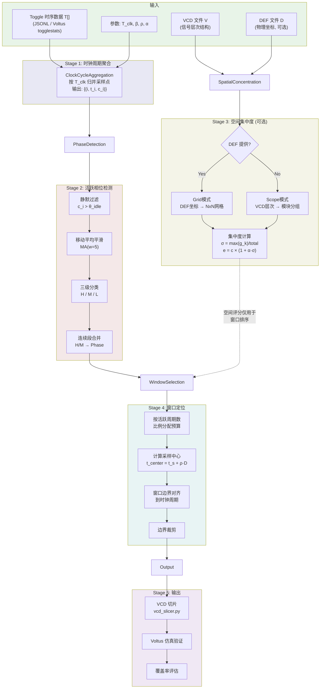
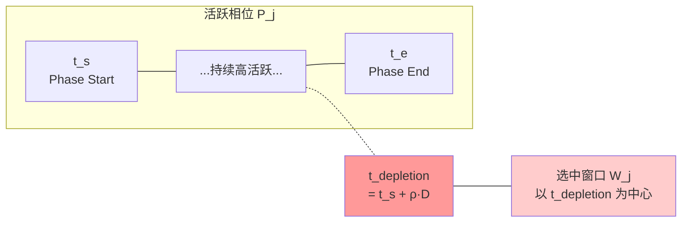

# MAVIREC: 基于相位感知与空间集中度的 Worst-Case IR Drop 窗口选取算法

**Multi-dimensional Activity-aware VCD IR-drop Estimation and Compression**

## 1 问题定义

给定一段完整的动态功耗仿真波形 $\mathcal{W}$（VCD 格式，时长 $T_{\text{sim}}$），从中选取一个或多个时间窗口 $\{W_1, W_2, \dots\}$，使得所选窗口能覆盖真实 worst-case IR Drop 时刻，且总窗口时长满足预算约束：

$$\sum_k |W_k| \leq \beta \cdot T_{\text{sim}}$$

其中 $\beta$ 为预算比例（如 $\beta = 0.1$ 即 10× 压缩）。

### 1.1 已知失败策略

**朴素滑动窗口法**（Baseline）：在全时间轴上滑动宽度为 $|W|$ 的窗口，选 toggle 总量最大的区间。该策略隐含假设"toggle 越多 = IR drop 越大"，在 Cadence Voltus v20 仿真中被证伪——toggle 排名第 1 的窗口（6900\~8085ns）并非 worst-case，实际 worst-case 出现在 toggle 排名第 45 的时钟周期（\~4050ns）。

**失败根因**：

- **时间维度**：IR drop 取决于片上退耦电容（decap）的累积耗尽，worst-case 不在翻转瞬时峰值，而在持续高活跃后电容耗尽的时刻
- **空间维度**：全局 toggle 总量 ≠ 局部 IR drop；相同总 toggle 分散在多个模块远不如集中在单个模块/区域危险

## 2 算法概述

本算法（**MAVIREC**）从时间和空间两个维度修正上述缺陷：

| 维度 | 策略 | 核心思想 |
|------|------|----------|
| **时间** | Phase-Aware 退耦耗尽模型 | 在活跃相位的 $\rho \approx 70\%$ 处采样，而非峰值处 |
| **空间** | 物理网格/层次集中度加权 | 翻转集中于少数区域时提高危险评分 |

### 2.1 算法流程图

## 3 符号定义

| 符号 | 含义 |
|------|------|
| $T_{\text{clk}}$ | 时钟周期（ns） |
| $N$ | 总时钟周期数 |
| $t_i$ | 第 $i$ 个时钟周期的起始时间 |
| $c_i$ | 第 $i$ 个时钟周期内的 toggle 总数 |
| $\bar{c}_i^{(w)}$ | 以 $i$ 为中心、窗口宽度 $w$ 的移动平均值 |
| $\theta_{\text{idle}}$ | 静默周期阈值（仅时钟翻转的 toggle 数） |
| $\theta_H, \theta_M$ | HIGH / MEDIUM 级别阈值 |
| $\mathcal{P}_j$ | 第 $j$ 个活跃相位（连续 H/M 周期的集合） |
| $\rho$ | 退耦耗尽采样比（默认 0.7） |
| $\beta$ | 预算比例（选中窗口总时长 / 仿真总时长） |
| $M_k$ | 第 $k$ 个空间分组（物理网格单元或层次模块） |
| $g_{i,k}$ | 第 $i$ 周期中分组 $M_k$ 的 toggle 数 |
| $\sigma_i$ | 第 $i$ 周期的空间集中度 $\in (0, 1]$ |
| $\alpha$ | 空间加权系数（默认 1.0） |

## 4 算法详细描述

### 4.1 Stage 1：时钟周期聚合

将原始 VCD 采样点（可能每纳秒多次变化）按时钟周期 $T_{\text{clk}}$ 归并，得到每周期的 toggle 总量。

---

**Algorithm 1** ClockCycleAggregation

---

**Input:** 原始时序数据 $\{(t, n)\}$，时钟周期 $T_{\text{clk}}$

**Output:** 周期统计序列 $\{(i, t_i, c_i)\}_{i=0}^{N-1}$

1. **for each** $(t, n) \in$ 原始数据 **do**
2. $\quad i \leftarrow \lfloor t / T_{\text{clk}} \rfloor$
3. $\quad c_i \leftarrow c_i + n$
4. **end for**
5. **return** 按 $i$ 升序排列的 $\{(i,\; i \cdot T_{\text{clk}},\; c_i)\}$

---

### 4.2 Stage 2：活跃相位检测

目标：将仿真时间划分为若干"活跃相位"（Phase），每个 Phase 代表一段持续的高翻转活动区间。

#### 4.2.1 静默过滤

去除仅有时钟翻转的周期：

$$\mathcal{A} = \{i \mid c_i > \theta_{\text{idle}}\}$$

#### 4.2.2 移动平均平滑

对活跃周期序列计算窗口宽度为 $w$（默认 5）的移动平均：

$$\bar{c}_i^{(w)} = \frac{1}{|S_i|} \sum_{j \in S_i} c_j, \quad S_i = [\max(0,\, i - \lfloor w/2 \rfloor),\; \min(|\mathcal{A}|,\, i + \lfloor w/2 \rfloor + 1))$$

#### 4.2.3 三级分类

基于活跃周期 toggle 分布计算自适应阈值：

$$\theta_H = 0.8 \times P_{75}(\{c_i\}_{i \in \mathcal{A}})$$
$$\theta_M = 0.5 \times \text{median}(\{c_i\}_{i \in \mathcal{A}})$$

每个活跃周期根据其移动平均值标注为 $L_i \in \{H, M, L\}$。

---

**Algorithm 2** PhaseDetection

---

**Input:** 周期统计 $\{(i, t_i, c_i)\}$，阈值 $\theta_{\text{idle}}$，MA 窗口 $w$

**Output:** 相位列表 $\{\mathcal{P}_1, \mathcal{P}_2, \dots\}$

1. $\mathcal{A} \leftarrow \{i \mid c_i > \theta_{\text{idle}}\}$ $\quad$ // 提取活跃周期
2. **for each** $i \in \mathcal{A}$ **do**
3. $\quad$ 计算移动平均 $\bar{c}_i^{(w)}$
4. **end for**
5. 计算 $\theta_H \leftarrow 0.8 \times P_{75}$，$\theta_M \leftarrow 0.5 \times \text{median}$
6. **for each** $i \in \mathcal{A}$ **do** $\quad$ // 三级标注
7. $\quad$ **if** $\bar{c}_i^{(w)} \geq \theta_H$ **then** $L_i \leftarrow$ H
8. $\quad$ **else if** $\bar{c}_i^{(w)} \geq \theta_M$ **then** $L_i \leftarrow$ M
9. $\quad$ **else** $L_i \leftarrow$ L
10. **end for**
11. // 合并连续 H/M 段为 Phase，L 段为分界
12. $\text{buf} \leftarrow \emptyset$，$\text{phases} \leftarrow []$
13. **for each** $i \in \mathcal{A}$ **do**
14. $\quad$ **if** $L_i \in \{H, M\}$ **then**
15. $\quad\quad$ $\text{buf} \leftarrow \text{buf} \cup \{i\}$
16. $\quad$ **else** // $L_i = $ L
17. $\quad\quad$ **if** 前方 3 周期内存在 H/M **and** $\text{buf} \neq \emptyset$ **then**
18. $\quad\quad\quad$ $\text{buf} \leftarrow \text{buf} \cup \{i\}$ $\quad$ // 短暂低谷，不切分
19. $\quad\quad$ **else**
20. $\quad\quad\quad$ **if** $\text{buf} \neq \emptyset$ **then** $\text{phases}.\text{append}(\text{buf})$；$\text{buf} \leftarrow \emptyset$
21. $\quad\quad$ **end if**
22. $\quad$ **end if**
23. **end for**
24. **if** $\text{buf} \neq \emptyset$ **then** $\text{phases}.\text{append}(\text{buf})$
25. **return** phases

---

### 4.3 Stage 3：空间集中度计算（可选）

当提供 VCD 文件或 DEF 文件时，启用空间维度分析。

#### 4.3.1 空间分组模式

本算法支持两种空间分组策略：

| 模式 | 输入 | 分组方式 | 适用场景 |
|------|------|----------|----------|
| **Grid** | DEF + VCD | 芯片版图划分为 $N \times N$ 物理网格，信号按坐标分配到网格单元 | 有版图数据时（精度最高） |
| **Scope** | VCD | 按 VCD 层次结构，信号映射到深度 $d$ 的模块 | 无版图数据时的近似 |

**Grid 模式**（Algorithm 3a）：

1. 解析 DEF 文件提取 COMPONENTS、PINS、NETS 段，获取每个 cell/pin 的物理坐标 $(x, y)$
2. 通过 NET 的 driver cell 坐标建立信号→坐标映射
3. VCD scope 路径 → DEF 层次路径转换：去除 testbench 前缀，`.` → `/`
4. 将芯片 bounding box 划分为 $N \times N$ 均匀网格
5. 每个信号映射到所在网格单元：$\text{col} = \lfloor (x - x_{\min}) / x_{\text{span}} \times N \rfloor$

**Scope 模式**（Algorithm 3b）：

信号 `test.u0.u_des0.clk` 在深度 $d=2$ 时映射到模块 `test.u0`。

#### 4.3.2 集中度评分

---

**Algorithm 3** SpatialConcentration

---

**Input:** 信号级 toggle 数据 $\{(t, \{s: b_s\})\}$，空间分组映射 $\phi: s \mapsto M_k$，加权系数 $\alpha$

**Output:** 有效评分序列 $\{(t, e_t)\}$

1. **for each** 时间点 $t$ **do**
2. $\quad$ **for each** 信号 $s$ with toggle 位串 $b_s$ **do**
3. $\quad\quad$ $n_s \leftarrow \text{popcount}(b_s)$ $\quad$ // 该信号的翻转 bit 数
4. $\quad\quad$ $g_{t, \phi(s)} \leftarrow g_{t, \phi(s)} + n_s$
5. $\quad$ **end for**
6. $\quad$ $c_t \leftarrow \sum_k g_{t,k}$ $\quad$ // 该时间点总 toggle
7. $\quad$ $\sigma_t \leftarrow \dfrac{\max_k(g_{t,k})}{c_t}$ $\quad$ // 空间集中度 $\in (0, 1]$
8. $\quad$ $e_t \leftarrow c_t \times (1 + \alpha \cdot \sigma_t)$ $\quad$ // 有效评分
9. **end for**
10. **return** $\{(t, e_t)\}$

---

**物理直觉**：当 $\sigma_t = 1$（所有翻转集中于单个区域）时，有效评分 $e_t = c_t \times (1+\alpha)$，最大放大 $(1+\alpha)$ 倍；当翻转均匀分布于 $K$ 个区域时 $\sigma_t = 1/K$，放大系数接近 1。这反映了翻转空间集中时局部电流密度更高、IR drop 更严重的物理事实。

> **关键设计决策**：空间集中度评分 $e_t$ **不用于**相位检测（Stage 2），因为 `detect_phases` 的阈值 $\theta_{\text{idle}}$ 等是针对原始 toggle 量标定的，加权后会导致阈值失效。$e_t$ 仅用于多相位间的窗口优先级排序。

### 4.4 Stage 4：Phase-Aware 窗口定位

核心思想：IR Drop 的 worst-case 不在翻转峰值时刻，而在退耦电容经过持续放电后接近耗尽的时刻。对于一个从 $t_s$ 开始、持续 $D$ 个时钟周期的活跃相位，电容耗尽点大约出现在：

$$t_{\text{depletion}} = t_s + \rho \cdot D \cdot T_{\text{clk}}$$

其中 $\rho$ 为退耦耗尽比，经验值 $\rho = 0.7$（即相位持续时间的 70% 处）。

---

**Algorithm 4** WindowSelection

---

**Input:** 相位列表 $\{\mathcal{P}_j\}$，仿真总时长 $T_{\text{sim}}$，预算比 $\beta$，退耦耗尽比 $\rho$，时钟周期 $T_{\text{clk}}$

**Output:** 窗口列表 $\{W_1, W_2, \dots\}$

1. $B_{\text{total}} \leftarrow \beta \cdot T_{\text{sim}}$ $\quad$ // 总预算时长
2. 过滤 $|\mathcal{P}_j| < n_{\min}$ 的微小相位
3. $N_{\text{active}} \leftarrow \sum_j |\mathcal{P}_j|$ $\quad$ // 所有相位的活跃周期总数
4. **for each** 相位 $\mathcal{P}_j$ **do**
5. $\quad$ // 按活跃周期数比例分配预算
6. $\quad$ $B_j \leftarrow B_{\text{total}} \times |\mathcal{P}_j| / N_{\text{active}}$
7. $\quad$ // 对齐到时钟周期（向上取整到偶数个周期）
8. $\quad$ $n_j \leftarrow \max\left(2,\; 2 \lfloor B_j / (2 T_{\text{clk}}) \rfloor\right)$
9. $\quad$ $B_j \leftarrow n_j \cdot T_{\text{clk}}$
10. $\quad$ // 窗口中心 = 退耦耗尽估计点
11. $\quad$ $t_{\text{center}} \leftarrow t_s^{(j)} + \rho \cdot (t_e^{(j)} - t_s^{(j)})$
12. $\quad$ // 窗口边界
13. $\quad$ $W_j.\text{start} \leftarrow t_{\text{center}} - B_j / 2$
14. $\quad$ $W_j.\text{end} \leftarrow t_{\text{center}} + B_j / 2$
15. $\quad$ // 边界裁剪：不超出相位范围 ± 1 个时钟周期
16. $\quad$ Clip $W_j$ to $[t_s^{(j)} - T_{\text{clk}},\; t_e^{(j)} + T_{\text{clk}}]$
17. $\quad$ Clip $W_j$ to $[0,\; T_{\text{sim}}]$
18. **end for**
19. **return** $\{W_j\}$ 按 toggle 总量降序排列

---

### 4.5 完整算法

---

**Algorithm 5** MAVIREC — FindWorstCaseWindow

---

**Input:**
- Toggle 时序文件 $\mathcal{T}$（JSONL 格式，每行含时间戳和各信号 toggle 位串）
- VCD 文件 $\mathcal{V}$（可选，提供信号层次结构）
- DEF 文件 $\mathcal{D}$（可选，提供物理坐标）
- 参数：$T_{\text{clk}}$, $\beta$, $\rho$, $\alpha$, $d$, $N_{\text{grid}}$

**Output:** 排序后的 worst-case 窗口列表 $\{W_1, W_2, \dots, W_K\}$

1. // ─── 数据加载与空间映射 ───
2. **if** $\mathcal{D}$ provided **then**
3. $\quad$ $\phi \leftarrow$ BuildGridMap($\mathcal{V}$, $\mathcal{D}$, $N_{\text{grid}}$) $\quad$ // 信号→物理网格映射
4. **else if** $\mathcal{V}$ provided **then**
5. $\quad$ $\phi \leftarrow$ BuildScopeMap($\mathcal{V}$, $d$) $\quad$ // 信号→模块映射
6. **else**
7. $\quad$ $\phi \leftarrow \emptyset$ $\quad$ // 无空间分析
8. **end if**
9.
10. **if** $\phi \neq \emptyset$ **then**
11. $\quad$ $(E, R, S) \leftarrow$ SpatialConcentration($\mathcal{T}$, $\phi$, $\alpha$)
12. **else**
13. $\quad$ $R \leftarrow$ LoadToggles($\mathcal{T}$)；$E \leftarrow R$
14. **end if**
15.
16. // ─── 时间维度分析（使用原始 toggle，不受空间加权影响） ───
17. $\{(i, t_i, c_i)\} \leftarrow$ ClockCycleAggregation($R$, $T_{\text{clk}}$)
18. $\{\mathcal{P}_j\} \leftarrow$ PhaseDetection($\{(i, t_i, c_i)\}$)
19.
20. // ─── Phase-Aware 窗口选取 ───
21. $\{W_k\} \leftarrow$ WindowSelection($\{\mathcal{P}_j\}$, $T_{\text{sim}}$, $\beta$, $\rho$, $T_{\text{clk}}$)
22.
23. // ─── 用原始 toggle 回填窗口统计 ───
24. **for each** $W_k$ **do**
25. $\quad$ $W_k.\text{toggles} \leftarrow \sum_{t_i \in W_k} c_i$
26. **end for**
27.
28. **return** $\{W_k\}$ ranked by toggles descending

---

## 5 参数选择依据

| 参数 | 默认值 | 选择依据 |
|------|--------|----------|
| $T_{\text{clk}}$ | 50 ns | 目标设计的时钟周期 |
| $\theta_{\text{idle}}$ | 200 | 经验值：纯时钟网络每周期约 100\~200 次翻转 |
| MA 窗口 $w$ | 5 | 平滑 2\~3 个周期的短暂波动 |
| $\rho$ | 0.7 | Voltus 实测验证：DES3 设计中 worst-case IR drop 出现在活跃相位的 \~70% 位置（4050ns / Phase 总长 \~5800ns ≈ 0.70） |
| $\alpha$ | 1.0 | 使集中度最大放大系数 = 2×，平衡时间和空间因素 |
| $N_{\text{grid}}$ | 8 | 8×8 = 64 个网格单元，粒度适中 |
| 层次深度 $d$ | 2 | 对应 RTL 中的子模块级别（如 `u_soc.u_des0`） |
| $\beta$ | 0.1 | 10× 压缩，兼顾覆盖率和效率 |
| $n_{\min}$ | 3 | 过滤过短的活跃段，避免噪声相位 |

## 6 实验验证

### 6.1 实验设置

| 项目 | 描述 |
|------|------|
| 设计 | DES3 三重加密核 |
| 信号规模 | 42,410 个信号 |
| 仿真时长 | 11,850 ns（237 个时钟周期，$T_{\text{clk}} = 50$ ns） |
| 工艺节点 | ASAP7 (7nm FinFET) |
| EDA 工具 | Cadence Innovus v20.10 + Voltus |
| IR Drop 分析精度 | XD (eXtreme Dynamic) |
| 供电电压 | $V_{\text{DD}} = 0.7$ V，阈值 0.651 V |

### 6.2 对比方案

| 方案 | 窗口策略 | 窗口数 | 总时长 | 占比 |
|------|---------|--------|--------|------|
| **Full** | 全 VCD（Ground Truth） | — | 11,850 ns | 100% |
| **Equal-5** | 等分为 5 个窗口 | 5 | 5×2,370 ns | 100% |
| **MAVIREC** | 本算法（$\rho=0.7$, $\beta=0.1$） | 2 | 1,100 ns | **9.3%** |
| **Baseline** | 朴素滑动窗口（max toggle） | 1 | 1,185 ns | 10% |

### 6.3 Worst-Case IR Drop 对比

| 方案 | 窗口范围 (ns) | Worst Vmin (V) | IR Drop (mV) | $C_1$ 覆盖率 |
|------|--------------|----------------|--------------|-------------|
| Full (Ground Truth) | 0 \~ 11,850 | 0.674 | 26.0 | — |
| **MAVIREC win1** | **3,790 \~ 4,390** | **0.674** | **26.0** | **100.0%** |
| **MAVIREC win2** | **9,600 \~ 10,100** | **0.674** | **26.0** | **100.0%** |
| Equal win1 | 0 \~ 2,370 | 0.676 | 24.0 | 92.3% |
| Equal win2 | 2,370 \~ 4,740 | 0.674 | 26.0 | 100.0% |
| Equal win3 | 4,740 \~ 7,110 | 0.678 | 22.0 | 84.6% |
| Equal win4 | 7,110 \~ 9,480 | 0.675 | 25.0 | 96.2% |
| Equal win5 | 9,480 \~ 11,850 | 0.675 | 25.0 | 96.2% |

### 6.4 逐层 IR Drop 覆盖率

$C_{\text{layer}}(l) = \text{IRdrop}_{\text{sub}}(l) / \text{IRdrop}_{\text{full}}(l)$

| 方案 | M6 | M5 | M4 | M3 | M2 | M1 | LISD | $C_{\text{layer,min}}$ |
|------|-----|-----|-----|-----|-----|-----|------|----------------------|
| **MAVIREC (each)** | **100.0%** | **100.0%** | **102.7%** | **103.1%** | **105.4%** | **106.9%** | **106.5%** | **100.0%** |
| Equal win1 | 57.3% | 57.3% | 56.6% | 91.2% | 89.1% | 89.4% | 90.1% | 56.6% |
| Equal win2 | 100.0% | 100.0% | 101.8% | 102.2% | 104.1% | 105.6% | 105.2% | 100.0% |
| Equal win3 | 80.2% | 81.0% | 79.9% | 81.5% | 80.5% | 80.6% | 82.3% | 79.9% |
| Equal win4 | 76.3% | 76.3% | 76.3% | 96.5% | 95.0% | 95.8% | 95.3% | 76.3% |
| Equal win5 | 95.7% | 96.1% | 98.2% | 97.8% | 99.5% | 101.4% | 101.3% | 95.7% |

### 6.5 组合窗口对比

| 组合方案 | 窗口数 | 总时长 | 占比 | $C_1$ | $C_{\text{layer,min}}$ | Violation |
|---------|--------|--------|------|-------|----------------------|-----------|
| **MAVIREC (algo_win1+win2)** | **2** | **1,100 ns** | **9.3%** | **100.0%** | **100.0%** | **PASS** |
| Equal best-2 (win2+win4) | 2 | 4,740 ns | 40.0% | 100.0% | 100.0% | PASS |
| Equal best-2 (win2+win5) | 2 | 4,740 ns | 40.0% | 100.0% | 100.0% | PASS |
| Equal all-5 | 5 | 11,850 ns | 100% | 100.0% | 100.0% | PASS |

### 6.6 关键结论

1. **MAVIREC 以 9.3% 的仿真时长实现 100% Worst-Case IR Drop 覆盖率**（$C_1 = 100\%$，$C_{\text{layer,min}} = 100\%$），且每个窗口独立均达到 100%

2. **等分方案需至少 40% 时长才能达到同等覆盖**：5 个等分窗口中仅 win2 单独达标（因恰好包含 worst-case 时刻），但这是偶然而非算法保证

3. **退耦耗尽比 $\rho = 0.7$ 的物理正确性**：Full VCD 的 Dynamic Worst Case Interval = 4,050 ns，MAVIREC win1 (3,790\~4,390ns) 精确覆盖该时刻

4. **逐层覆盖率超过 100%** 表明 MAVIREC 选中的窗口比全 VCD 平均更"严酷"（全 VCD 的平均效应稀释了 worst-case 层的压降）

## 7 时间复杂度

设原始采样点数为 $S$，信号数为 $N_{\text{sig}}$，时钟周期数为 $C = T_{\text{sim}} / T_{\text{clk}}$：

| 阶段 | 复杂度 |
|------|--------|
| 时钟周期聚合 | $O(S)$ |
| 移动平均 + 分类 | $O(C \cdot w)$ |
| 空间集中度 | $O(S \cdot N_{\text{sig}})$ |
| DEF 解析（Grid 模式） | $O(N_{\text{DEF}})$，$N_{\text{DEF}}$ 为 DEF 行数 |
| 窗口选取 | $O(P)$，$P$ 为相位数（通常 $\ll C$） |
| **总计** | $O(S \cdot N_{\text{sig}} + N_{\text{DEF}})$ |

算法为单遍扫描，无迭代优化步骤，适用于大规模工业设计。

## 8 算法实现

| 文件 | 功能 |
|------|------|
| `select_worst_window.py` | 核心库：ClockCycleAggregation, PhaseDetection, WindowSelection |
| `find_worst_window.py` | 完整入口：Phase-Aware + Grid/Scope 空间集中度 |
| `vcd_def_mapper.py` | DEF 解析 + VCD 信号→物理坐标映射 |
| `vcd_slicer.py` | VCD 时间窗口切片（保持 hold-last-value 正确性） |
| `coverage_tier1.py` | 自动覆盖率评估：解析 Voltus 报告并计算 $C_1$, $C_{\text{layer}}$ |
